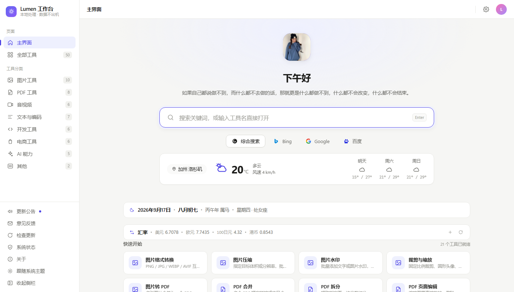

# Lumen 工作台

本地优先的个人 AI 工作台。整个应用就是三个文件（`index.html` + `app.js` + `style.css`），浏览器双击即用；也可以用内置的 Electron 最小壳跑成桌面窗口。



## 特点

- **本地优先**：所有图片处理、二维码、文本工具全部在本机完成，文件不上传
- **轻量无依赖**：三个文件即可运行，无框架、无后端、无注册
- **无需注册**：没有账号体系；AI 能力规划为 BYOK（自带 API Key）
- **桌面壳可选**：`shell/` 是一个约 70 行的 Electron 最小壳，只负责开窗口和把外链交给系统浏览器

## 主界面

- **农历日历**：公历 + 农历双历、干支生肖、节气节日，纯本地计算不联网
- **实时汇率**：1 外币兑人民币，支持自选币种（最多 6 个），数据源为欧央行 Frankfurter，失败自动切换备用源
- **搜索联想**：搜索框输入即匹配工具，↑↓ 选择回车直达
- **检查更新**：自动对比最新版本，有新版一键前往下载

## 工具

目前 48 个工具中已实装 9 个，其余为占位（分类：图片 / PDF / 音视频 / 文本与编码 / 开发 / 电商 / AI / 其他）：

| 工具 | 说明 |
|---|---|
| 图片格式转换 | PNG / JPG / WEBP / AVIF，批量、质量、缩放 |
| 图片压缩 | 目标体积二分搜索质量 / 指定质量 / 只缩尺寸 |
| 图片水印 | 文字 / 图片水印，九宫格 + 自由拖拽 + 平铺 |
| 裁剪与缩放 | 八向手柄、比例锁定、圆形头像、批量统一尺寸 |
| 二维码生成器 | 批量、容错等级、码点样式、颜色、中心 Logo、PNG / SVG 导出 |
| 网页图片提取 | 输入网址抓取页面全部图片（联网） |
| 二维码解码 | 本地识别（jsQR，不上传）/ 图片直链兜底 |
| 违禁词检测 | 广告法极限词分级高亮 + 替换建议 + 自定义词库 |
| 利润定价计算 | 成本 / 扣点 / 推广费 → 净利 / 盈亏平衡 / 反推定价 |

## 运行

**方式一：浏览器（最简单）**

双击 `index.html` 即可，全部功能可用。

**方式二：Electron 桌面窗口**

```bash
npm install
npm start
```

> 国内网络下载 Electron 二进制慢的话，先设置镜像：
>
> ```bash
> # Windows (PowerShell)
> $env:ELECTRON_MIRROR="https://npmmirror.com/mirrors/electron/"
> npm install
> ```

## 说明

- 主界面的天气（Open-Meteo）、热榜、一言为免费公开接口，失败会自动降级，不影响其他功能
- AI 工具（占位中）规划走 BYOK 模式：自带 API Key，请求从本机直连服务商
- 二维码生成 / 解码、图片处理等均为纯本地实现，不依赖任何第三方接口

## 反馈

邮箱：rijinwe7396@163.com（应用内「意见反馈」弹窗也可一键直达）

## 赞助

如果 Lumen 工作台帮到了你，欢迎请作者喝杯奶茶 ☕ 你的支持是我继续更新的动力～

<p>
  
</p>

## License

本仓库代码不使用开源协议，保留所有权利（All Rights Reserved）。详见 [LICENSE](LICENSE)。

未经作者书面许可，**禁止**复制、修改、二次分发、二次开发及任何商业用途；仅允许查看与本仓库在线内容的学习性阅读。
