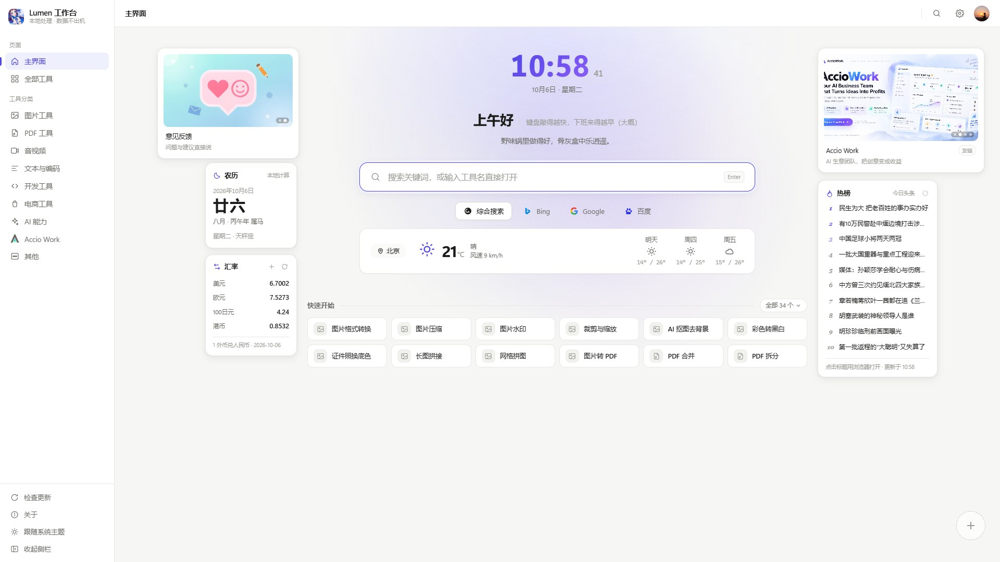

# Lumen Workbench


English | [中文](./README.zh-CN.md)

A local-first personal AI workbench. The entire app is just three files (`index.html` + `app.js` + `style.css`) — double-click `Lumen.html` in your browser and it works. You can also run it as a desktop window with the bundled Electron shell, or install the Windows installer directly.

> Current version **v0.14.2** | 55 tools, 29 fully implemented



## Highlights

- **Local-first**: image processing, PDF, QR code and text tools all run on your machine — files never leave your computer
- **Lightweight, zero dependencies**: three files are all it takes; no framework, no backend, no sign-up
- **No account required**: AI features use BYOK (bring your own API key; requests are relayed by the shell's main process, keys never leave your machine)
- **Data stays local**: history, AI settings and price notes all live in your local browser storage; uninstall to wipe
- **Multi-language**: the interface supports 简体中文 / English / 日本語 — auto-detected on first launch, switchable anytime in Settings
- **Optional desktop shell**: `shell/` is a lightweight Electron shell that does seven things — opens a window (over a local port, same origin as the browser),
  **local port service** (starts `http://127.0.0.1:17870` on launch; opening that address in a browser shows the very same workbench; if the port is taken it identifies the occupier first, then falls back to the next free port),
  hands external links to the system browser, relays network requests (bypassing CORS — the official hot-list source and AI chat both go through this channel; on the browser side the same-origin relays `/__lumen/net` and `/__lumen/chat` handle it),
  screen recording (lists screen/window sources, captures system audio, saves straight to disk — see `shell/rec.js`),
  minimizes to tray on close (the port service keeps running; the tray menu offers show window / open in browser / copy address / shell status / restart port / quit — reopening the shell recalls the window and restarts the port service),
  and a **shell status page** (`shell/status.html`: run mode, port, port-conflict diagnostics, recent logs; loaded from a local file, so it opens even if the port service is down).
  To force the legacy `file://` mode set the env var `LUMEN_MODE=file`; the port can be changed with `LUMEN_PORT`. For development use `npm run dev`, which runs on port 17871 with an isolated data directory.
- **Automatic fallback for free APIs**: weather / exchange rates / hot lists / parcel tracking all have backup sources or multi-level fallbacks — one failing never breaks the rest

## Home screen

- **Lunar calendar**: solar + lunar dual calendar, ganzhi & zodiac, solar terms and festivals — computed locally, no network needed
- **Live exchange rates**: 1 unit of foreign currency to CNY, pick your own currencies (up to 6); data from ECB via Frankfurter, auto-switches to a backup source on failure
- **Today's hot list**: same board as the Toutiao app; sits in the right-hand whitespace on wide windows, hides itself on failure
- **Local music**: drag songs from a folder in and use them as work BGM — played purely locally
- **Search suggestions**: typing matches tools instantly; ↑↓ to pick, Enter to open
- **Frequent tools**: auto-sorted by recent use; right-click to pin favorites
- **Startup self-check**: on launch, checks the local environment (storage / canvas / export / clipboard / WASM / network, 7 items) and external API health; issues light up in the sidebar with details, never blocking use
- **Check for updates**: compares the latest version across multiple sources concurrently (raw / jsDelivr / GitHub API — any one reachable is enough); the dialog shows a "current ⟶ latest" comparison with update instructions and a one-click jump to download
- **About**: one-line intro + stats dashboard (tools / implemented / categories) + quick start & shortcuts + sponsor link

## Tools

Currently **55 tools**, of which **29 are fully implemented**; the rest are placeholders being rolled out.

- **Images**: format conversion, compression, watermark, crop & resize, images to PDF
- **PDF**: merge, split, page editing, watermark, paging seal, compress, to images, extract text
- **E-commerce**: banned-word detection, parcel tracking, profit & pricing calculator, price notes
- **AI**: AI chat (BYOK, multi-model / streaming / local sessions)
- **Accio Work**: skill-pack tutorial center (9 packs) & user guide
- **Others**: web image extractor, QR code generator / scanner, video prompt helper, and more

See [Releases](https://github.com/lyz0v0/lumen-workbench/releases) for per-version changes.

## Prerequisites

| How you run it | What you need | Version |
|---|---|---|
| Open in browser | None (any modern browser: Chrome / Edge / Firefox, preferably a recent version) | — |
| One-click start `setup.bat` | [Node.js](https://nodejs.org) (npm ships with Node) | **Node.js 18 or later**, LTS (20 / 22) recommended |
| Windows installer | None | Windows 10 / 11 (64-bit) |

Notes:

- The one-click start downloads Electron on first run (~90 MB; npmmirror is used automatically inside mainland China), fully offline afterwards
- The installer bundles all runtimes (Electron + Chromium) — install and go, no Java / Python / .NET needed
- System requirements: Windows 10 or later (64-bit); the browser mode also works on macOS / Linux

## Run

**Option 1: Browser (simplest)**

Double-click `Lumen.html` — every feature works (`index.html` is the same file under a compatibility name).

**Option 2: One-click start (Electron desktop window)**

Double-click **`setup.bat`** in the repo: the first run installs Electron via npm (npmmirror inside mainland China), then opens the desktop window automatically; every later double-click just starts it. Requires Node.js 18+ (you'll get a clear message if Node is missing or too old).

You can also install and start manually:

```bash
npm install
npm start
```

> The desktop window adds a "main-process relay" channel: the official hot-list source and AI chat (some providers don't send CORS headers) fall back to secondary sources in browser mode, but work directly inside the shell.

**Option 3: Windows installer (recommended)**

Download `lumen-workbench-setup.exe` from [Releases · Latest](https://github.com/lyz0v0/lumen-workbench/releases/latest) and double-click to install: step-by-step wizard, choose your own install location, Start Menu shortcut created automatically.

- **In-app auto-update**: when a new version ships, "Check for updates" in the app downloads and upgrades in one click — all your data is kept
- Closing the window minimizes to the tray; right-click the tray icon to quit or open the shell status page

## Notes

- Weather (Open-Meteo), exchange rates (Frankfurter), hot lists and the hitokoto quote on the home screen are free public APIs; they degrade gracefully and never break other features
- Parcel tracking uses a free aggregated API, 30 requests/day, resets the next day
- AI tools use BYOK: your own API key, requests go straight from the shell's main process to the provider (browser mode uses direct connection + fallback sources); this repo contains no keys and runs no proxy
- PDF, image processing and QR code generation / scanning are purely local — no third-party API involved, files never leave your machine

## Feedback

Email: rijinwe7396@163.com (the "Feedback" dialog inside the app links here too)

## Sponsor

If Lumen Workbench helps you, feel free to buy the author a coffee ☕ Your support keeps the updates coming!

<p>
  
</p>

## License

The code in this repository is **not** open source — All Rights Reserved. See [LICENSE](LICENSE).

Without the author's written permission, you may **not** copy, modify, redistribute, create derivative works of, or use this repository commercially; viewing and reading the online content of this repository for learning purposes is allowed.
